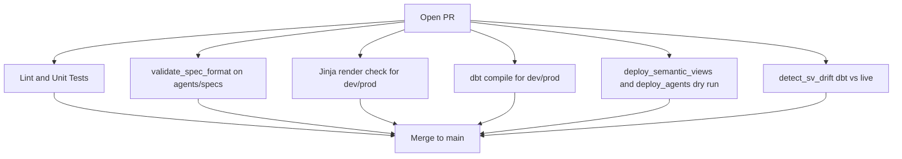
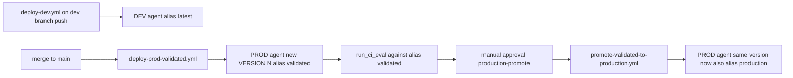

# Environment Parity and Drift Prevention

This project deploys semantic views and agents to two Snowflake environments
(DEV, PROD). Internal pre-release validation happens inside PROD via the
`validated` alias on each agent — there is no separate QA environment.

## Source of Truth

| Artifact | Source of Truth | Deploy path |
|---|---|---|
| Semantic views | `dbt_ski_resort/models/marts/semantic/sem_*.sql` | `dbt run` via deploy workflows |
| Agents | `agents/specs/*.yml` | `agent_management.deploy_agents` (versioning path) |
| Verified queries | `semantic-views/verified_queries/*.yaml` | `agent_management.sync_vqrs_to_dbt` (merged into dbt SV model) |
| Evaluation datasets | `agent-evaluation/datasets/*.yaml` | Rendered into Snowflake by `agent-evaluation/scripts/run_eval.py` |

### Semantic views: either source works

`environments/{dev,prod}.env.yml` set `semantic_views.source: dbt` here,
but the library supports both shapes and auto-detects when the flag is
absent:

| Config | Source of truth | Files |
|--------|----------------|-------|
| `semantic_views.source: dbt` | dbt SQL models | `dbt_ski_resort/models/marts/semantic/sem_*.sql` |
| `semantic_views.source: yaml` | Jinja-templated YAML | `semantic-views/definitions/sem_*.yaml` |

Repos that don't use dbt can remove `dbt_ski_resort/` entirely and ship
YAML SV definitions; `deploy_semantic_views` and `detect_sv_drift` both
work without any code change. Repos that use dbt can delete the YAML
shadow copies if they want a single source.

- `deploy_semantic_views.py` picks its deploy path from `semantic_views.source`.
- `detect_sv_drift.py` honors the same field, or the `--source {dbt,yaml,auto}`
  CLI flag. In `auto` mode it prefers dbt when both are present.
- The drift check never calls `SYSTEM$CREATE_SEMANTIC_VIEW_FROM_YAML` by
  hand — the deploy workflow owns that. Drift comparison is parse-only.

### Agents: versioning is the only source

Committed `VERSION$N` on the agent object in Snowflake is the ground truth for
what spec is serving traffic. The spec YAML in `agents/specs/` is the *input*
to deploys; after a deploy, the rendered spec lives in `VERSION$N` forever.

See [docs/operations/AGENT_VERSIONING.md](docs/operations/AGENT_VERSIONING.md).

## PR Validation Gates

Every PR runs the following gates against both environments in parallel
(matrix `[dev, prod]`):

A PR that passes the gate is guaranteed to deploy cleanly to PROD on merge.

## Promotion flow

## Drift checks

`detect_sv_drift` compares:

- the dbt SV SQL (structurally: tables / dims / facts / metrics)
- the live `SYSTEM$READ_YAML_FROM_SEMANTIC_VIEW` output

for each configured semantic view. It runs per env in validate-pr, and is
advisory today; the goal is blocking once existing drift is resolved.

## When env parity breaks

If DEV and PROD have different SV shapes you'll see:

- `detect_sv_drift` flag on the PR
- `deploy_agents --dry-run` fail because the agent spec references columns
  that don't exist in the target env's SV

Fix by reconciling dbt models (the source of truth) and re-running the gate.
