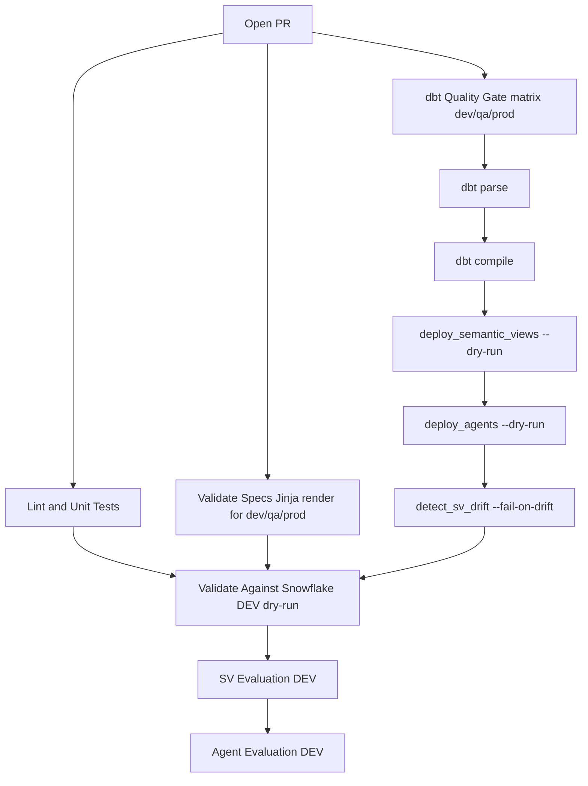
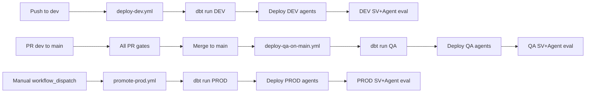

# Environment Parity and Drift Prevention

This project deploys semantic views and agents to three Snowflake environments
(DEV, QA, PROD). To keep the environments identical and prevent the class of
bug where a change "works in DEV but breaks in QA", we enforce a single
source of truth and validate every change against all three envs before
merge.

## Source of Truth

| Artifact | Source of Truth | Deploy path |
|---|---|---|
| Semantic views | `dbt_ski_resort/models/marts/semantic/sem_*.sql` | `dbt run` via push/promote workflows |
| Agents | `agents/specs/*.yml` | `agent_management.deploy_agents` |
| Verified queries | `semantic-views/verified_queries/*.yaml` | `agent_management.deploy_svs_yaml` (merged onto live SV) |
| Evaluation datasets | `agent-evaluation/datasets/*.yaml` | Rendered into Snowflake by `agent-evaluation/scripts/run_eval.py` |

### Semantic views: dbt is the only source

`environments/{dev,qa,prod}.env.yml` all set `semantic_views.source: dbt`.
That means:

- SVs are created/updated exclusively by running the dbt `semantic_view`
  materialization for the target environment.
- The YAML files in `semantic-views/definitions/` are a **shadow copy** used
  by `validate_specs`, `detect_drift`, and the template rendering tests. They
  do NOT deploy and can drift from the dbt model. The `detect_sv_drift`
  job in the PR gate ensures drift is surfaced.
- **Never call `SYSTEM$CREATE_SEMANTIC_VIEW_FROM_YAML` by hand** against a
  deployed environment. It creates a silent divergence between dbt and the
  deployed SV, which the drift check will flag.

## PR Validation Gates

Every PR runs the following gates against all three environments in parallel:



### What each gate catches

| Gate | Catches |
|---|---|
| Lint & Unit Tests | Python / template syntax errors |
| Validate Specs | Jinja rendering failures, missing env vars, env-specific DB mismatches |
| dbt parse | dbt YAML and Jinja errors in the dbt project |
| dbt compile | SQL compilation against Snowflake (e.g. `invalid identifier`) for each env |
| deploy_semantic_views --dry-run | SV deploy wiring errors for each env |
| deploy_agents --dry-run | Agent spec errors for each env |
| detect_sv_drift | Deployed SV in any env differs from dbt source of truth |
| SV Evaluation | Cortex Analyst VQR accuracy regressions |
| Agent Evaluation | Agent answer_correctness / logical_consistency regressions |

### The "DIM_DATE_KEY" incident this protects against

Before these gates existed, a SV DDL error `invalid identifier 'DIM_DATE_KEY'`
passed DEV dbt run (because DEV had a manual deploy masking the bug), passed
PR validation (because `dbt parse` does not compile SQL), and then broke the
QA auto-deploy after the PR merged to main.

The `dbt compile --target qa` and `dbt compile --target prod` steps now run
in the PR gate and would have failed the PR before merge. The
`detect_sv_drift` step would additionally have surfaced the manual DEV deploy
as drift.

## Running Checks Locally

Before pushing, you can run the same gates locally:

```bash
# Compile dbt for all three envs
cd dbt_ski_resort
dbt deps
for tgt in dev qa prod; do
  dbt parse --profiles-dir . --target $tgt
  dbt compile --profiles-dir . --target $tgt
done
cd ..

# Dry-run deploys for each env
for env in dev qa prod; do
  python -m agent_management.deploy_semantic_views --env $env --dry-run
  python -m agent_management.deploy_agents --env $env --dry-run
done

# Detect drift between deployed and dbt source of truth
for env in dev qa prod; do
  python -m agent_management.detect_sv_drift --env $env
done
```

Use your own Snowflake credentials / `SNOWFLAKE_CONNECTION_NAME` — the local
checks do not deploy anything except a temporary scratch SV inside
`detect_sv_drift` that is dropped after the diff.

## Recovering from Drift

If `detect_sv_drift` flags a difference:

1. Inspect the diff in the job log.
2. Decide which side is correct:
   - **dbt model is correct**, deployed is stale
     → `dbt run --select <model> --target <env>` to redeploy.
   - **Deployed is correct**, dbt model is wrong
     → update the dbt model (`dbt_ski_resort/models/marts/semantic/*.sql`) to
       match, then deploy via dbt.
3. Re-run the PR validation. It should now be green.

Never "fix" the drift by making another manual
`SYSTEM$CREATE_SEMANTIC_VIEW_FROM_YAML` call — it will drift again on the
next deploy.

## Deploy Flow After Merge



QA deploys automatically on every merge to `main`. PROD requires a manual
`workflow_dispatch` trigger on `promote-prod.yml`. The PR gates must be
green before merge, so by the time QA auto-deploys the same dbt models have
already compiled cleanly against QA in the PR.
