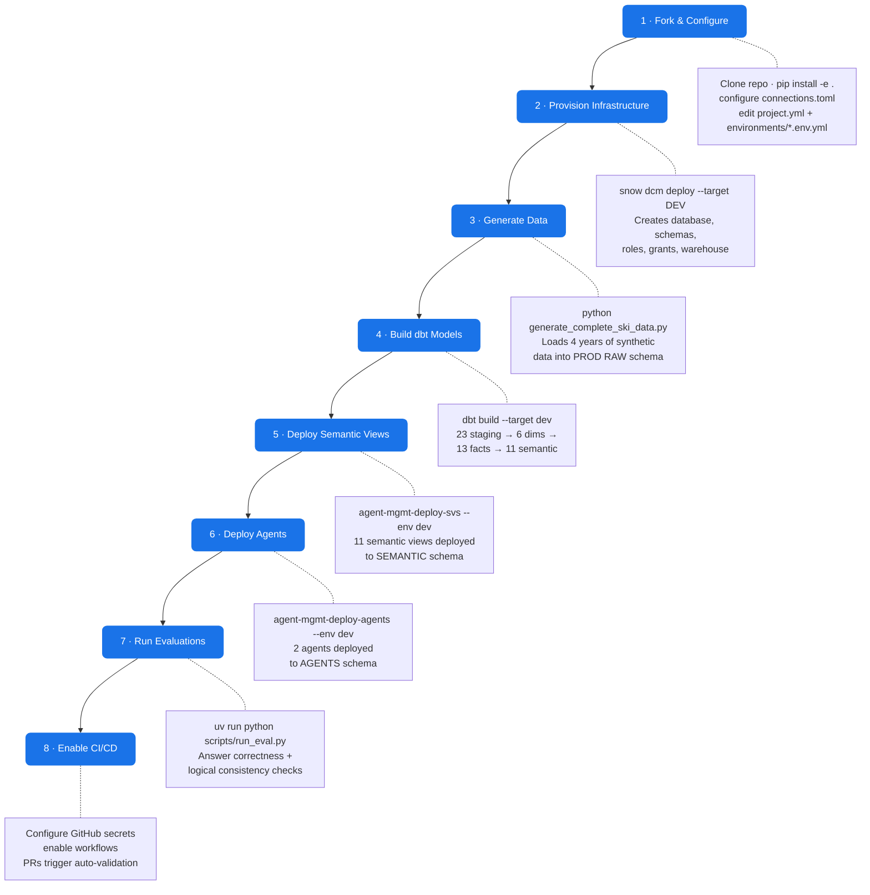
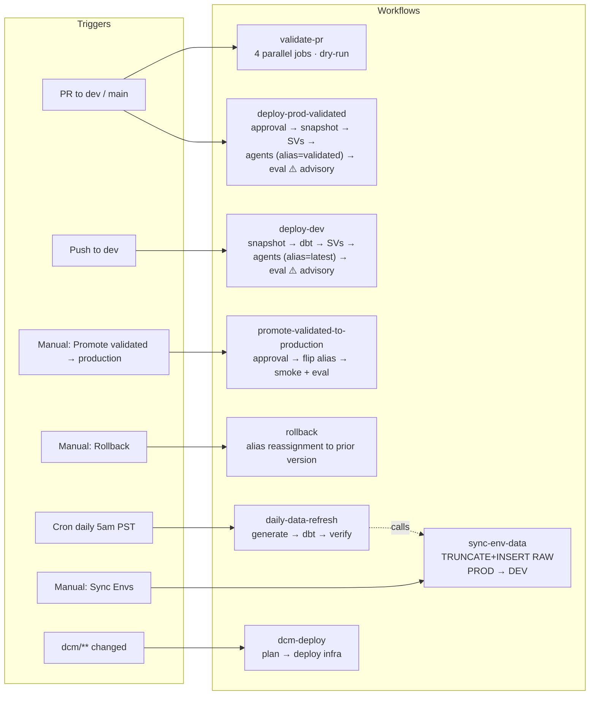
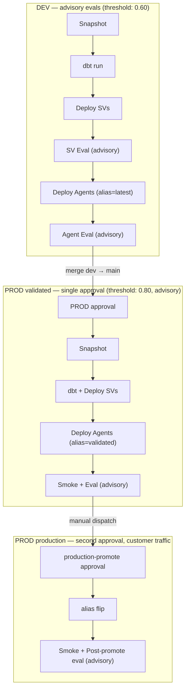

# Agent Management — CI/CD Reference Framework for Snowflake Cortex Agents

A production-quality CI/CD framework for managing **Snowflake Cortex Agents**, **Semantic Views**, and **dbt** as code. Define agents and semantic views in YAML, deploy through environment-parameterized pipelines, evaluate with golden question sets, and rollback from snapshots when things break.

Built as a reference implementation — fork it, swap in your domain, ship it.

## What This Repo Does

```
RAW data (12 tables)
  → dbt transforms (23 staging views → 6 dimensions → 13 facts)
    → 11 Semantic Views (Cortex Analyst)
      → 2 Cortex Agents (natural language interface)
        → Automated Evaluations (answer_correctness, logical_consistency)
```

The framework manages the full lifecycle across two environments (DEV, PROD), each in its own Snowflake database. PROD additionally carries a `validated` alias for pre-production internal validation before customer traffic is routed via the `production` alias. Infrastructure is provisioned by DCM. Data flows from PROD (source of truth) to DEV via zero-copy clones.

## Architecture at a Glance

```
┌─────────────────────────────────────────────────────────────────┐
│  Git Repository                                                 │
│                                                                 │
│  project.yml ─── Single source of truth for names/config        │
│       │                                                         │
│  environments/                                                  │
│    dev.env.yml ── Database, role, warehouse, agent name_suffix  │
│    prod.env.yml                                                 │
│       │                                                         │
│  ┌────┴──────────────────────────────────────────────────┐      │
│  │  Deploy Pipeline (order matters)                       │      │
│  │                                                        │      │
│  │  1. DCM         → databases, schemas, roles, grants    │      │
│  │  2. dbt run    → staging → dims → facts → semantic     │      │
│  │  3. Deploy SVs  → SYSTEM$CREATE_SEMANTIC_VIEW_FROM_YAML│      │
│  │  4. Deploy Agents → ALTER AGENT / CREATE AGENT         │      │
│  │  5. Evaluate    → EXECUTE_AI_EVALUATION + thresholds   │      │
│  └────────────────────────────────────────────────────────┘      │
└─────────────────────────────────────────────────────────────────┘

┌─────────────────────────────────────────────────────────────────┐
│  Snowflake (single account, 2 databases)                        │
│                                                                 │
│  AM_SKI_RESORT_DEV (developer iteration)                        │
│    RAW (cloned from PROD)                                       │
│    STAGING / MARTS                                              │
│    SEMANTIC (11 SVs)                                            │
│    AGENTS                                                       │
│      RESORT_EXECUTIVE_DEV   alias: latest                       │
│      SKI_OPS_ASSISTANT_DEV  alias: latest                       │
│                                                                 │
│  AM_SKI_RESORT (source of truth + customer traffic)             │
│    RAW (real data)                                              │
│    STAGING / MARTS / SEMANTIC / AGENTS / DBT_TEST__AUDIT        │
│      RESORT_EXECUTIVE   aliases: validated, production          │
│      SKI_OPS_ASSISTANT  aliases: validated, production          │
└─────────────────────────────────────────────────────────────────┘
```

## Quick Start

```bash
git clone https://github.com/Jeremy-Demlow/AgentMangement.git
cd AgentMangement

pip install -e ".[dev]"

# Validate all specs
agent-mgmt-validate --env dev

# Dry-run deploy
agent-mgmt-deploy-svs --env dev --dry-run
agent-mgmt-deploy-agents --env dev --dry-run

# Deploy for real
agent-mgmt-deploy-svs --env dev
agent-mgmt-deploy-agents --env dev
```

## Building From This Repo

### Agent development framework

Every agent in this repo follows a documented best-practices framework.
Before creating or modifying an agent, start at
[framework/README.md](framework/README.md). Key artifacts:

- [framework/AGENT_BEST_PRACTICES.md](framework/AGENT_BEST_PRACTICES.md) — principles, priority order, common pitfalls
- [framework/TOOL_DESCRIPTION_TEMPLATE.md](framework/TOOL_DESCRIPTION_TEMPLATE.md) — the required tool description format (CI-enforced)
- [framework/VQR_AUTHORING_GUIDE.md](framework/VQR_AUTHORING_GUIDE.md) — how to pick and write Verified Queries
- [framework/AGENT_OPTIMIZATION_CHECKLIST.md](framework/AGENT_OPTIMIZATION_CHECKLIST.md) — step-by-step checklist before opening a PR
- [framework/templates/new_agent_spec.yml](framework/templates/new_agent_spec.yml) — starter template

See also [ENVIRONMENT_PARITY.md](ENVIRONMENT_PARITY.md) for the
dbt-as-source-of-truth CI gate design.


The diagram below shows the eight phases a new user follows — from forking the repo through production CI/CD. Each phase builds on the previous one.



### Phase 1 — Fork and Configure

```bash
git clone <your-fork> && cd AgentMangement
pip install -e ".[dev,crypto]"

vim ~/.snowflake/connections.toml   # Add [myconnection] with account, user, private_key_path
vim project.yml                     # Set account, schemas, deployment mode
vim environments/dev.env.yml        # Set database, role, warehouse, thresholds
vim environments/prod.env.yml
```

### Phase 2 — Provision Infrastructure (DCM)

```bash
cd dcm
vim manifest.yml                    # Update account_identifier, project names per target

snow dcm create DCM.AM.AM_SKI_RESORT_DEV --if-not-exists -c myconnection
snow dcm plan  --target DEV -c myconnection
snow dcm deploy --target DEV -c myconnection --alias "initial-setup"
```

Creates: database, 7 schemas (RAW, STAGING, MARTS, DOCS, SEMANTIC, AGENTS, DBT\_TEST\_\_AUDIT), warehouse, 3 database roles (ADMIN / DEVELOPER / ANALYST), deploy role, all grants. See [`dcm/README.md`](dcm/README.md).

### Phase 3 — Generate Data

```bash
cd data-generation

python generate_complete_ski_data.py                    # Full 4-year history → PROD RAW
python generate_daily_increment.py --env dev --days 30  # Or: daily incremental
```

Or sync PROD RAW → DEV (zero-copy):
```bash
# GitHub Actions → sync_env_data.yml with target_envs: dev
```

### Phase 4 — Build dbt Models

```bash
cd dbt_ski_resort
dbt deps
dbt build --target dev    # 23 staging → 6 dims → 13 facts → 11 semantic
dbt test                  # Run all data tests
```

### Phase 5 — Deploy Semantic Views

```bash
agent-mgmt-validate --env dev                           # Lint YAML specs
agent-mgmt-deploy-svs --env dev --dry-run               # Review generated SQL
agent-mgmt-deploy-svs --env dev                         # Deploy 11 SVs
agent-mgmt-detect-drift --env dev                       # Verify column alignment
```

### Phase 6 — Deploy Agents

```bash
agent-mgmt-deploy-agents --env dev --dry-run            # Review ALTER/CREATE SQL
agent-mgmt-deploy-agents --env dev                      # Deploy 2 agents
```

### Phase 7 — Run Evaluations

```bash
cd agent-evaluation && uv sync

uv run python scripts/run_eval.py configs/resort_executive.yaml \
    --connection myconnection --env dev

agent-mgmt-metrics --env dev                            # Check threshold results
```

### Phase 8 — Enable CI/CD Pipelines

```bash
# 1. Set repo-level secrets
gh secret set SNOWFLAKE_ACCOUNT  --body "your-account"
gh secret set SNOWFLAKE_USER     --body "your-user"
gh secret set SNOWFLAKE_PRIVATE_KEY < ~/.snowflake/keys/rsa_key.p8

# 2. Set per-environment secrets and variables (DEV, PROD)
.github/scripts/setup_github_secrets.sh
.github/scripts/setup_github_environments.sh

# 3. Push — PRs now trigger validate-pr.yml, merges to dev trigger deploy-dev.yml
```

## CI/CD Pipeline Architecture

Eight workflows cover the full lifecycle. Arrows show trigger relationships:



### Promotion Flow: DEV → PROD validated → PROD production

DEV evals are advisory; iteration speed is the priority. PROD has two aliases: `validated` is moved automatically by the deploy on main-merge (after a single approval). `production` is moved manually after a second human approval. Threshold failures on PROD evals are advisory: deploy still completes, but the operator decides whether to promote and can trigger rollback if needed.



## Repository Structure

```
AgentMangement/
│
├── project.yml                      # Central config: databases, schemas, deployment mode
├── pyproject.toml                   # pip install -e . (agent-mgmt 0.5.0)
│
├── environments/                    # Per-env config (database, role, warehouse, name_suffix)
│   ├── dev.env.yml
│   └── prod.env.yml
│
├── agent_management/                # Core Python library (pip-installable)
│   ├── deploy_agents.py             #   ALTER AGENT / CREATE AGENT
│   ├── deploy_semantic_views.py     #   SYSTEM$CREATE_SEMANTIC_VIEW_FROM_YAML
│   ├── render_template.py           #   Jinja2 env substitution
│   ├── snapshot_state.py            #   Pre-deploy state capture
│   ├── rollback.py                  #   Restore from snapshot
│   ├── validate_specs.py            #   YAML lint + dry-run
│   ├── detect_drift.py              #   Git vs Snowflake diff
│   ├── compute_metrics.py           #   F1/precision/recall from eval
│   ├── check_sv_eval.py             #   SV eval quality gate
│   ├── run_sv_eval.py               #   Run SV evals end-to-end
│   ├── get_sv_eval_scores.py        #   SV eval scorecard (GET_ANALYST_AI_EVALUATION_DATA)
│   ├── check_sv_evals.py            #   Multi-env VQR + eval status
│   ├── render_eval_templates.py     #   Render eval configs per env
│   ├── ci/                          #   CI checks (test coverage, PK tests, lineage)
│   └── utils/
│       ├── config.py                #   Config loading, FQN helpers, suffix resolution
│       └── snowflake_client.py      #   Snowflake connection wrapper
│
├── agents/                          # Cortex Agent definitions
│   └── specs/                       #   Jinja2 YAML templates
│       ├── resort_executive.yml
│       └── ski_ops_assistant.yml
│
├── semantic-views/                  # Semantic View definitions (standalone path)
│   └── definitions/                 #   11 Jinja2 YAML templates
│
├── agent-evaluation/                # Evaluation framework (separate README)
│   ├── scripts/run_eval.py          #   End-to-end eval runner
│   ├── configs/                     #   One config per agent
│   ├── datasets/                    #   Golden question sets per agent
│   ├── metrics/                     #   Custom LLM-judge metrics
│   └── results/                     #   JSON results from runs
│
├── dbt_ski_resort/                  # dbt project (separate README)
│   └── models/
│       ├── staging/                 #   23 type-safe views
│       ├── marts/dimensions/        #   6 dimension tables
│       ├── marts/facts/             #   13 fact tables (incremental)
│       └── marts/semantic/          #   11 semantic views (dbt materialization)
│
├── dcm/                             # Infrastructure as Code (separate README)
│   ├── manifest.yml                 #   DEV/PROD targets
│   └── sources/                     #   Database, schemas, roles, grants
│
├── data-generation/                 # Synthetic ski resort data
│
├── .github/workflows/               # CI/CD pipelines
│   ├── validate-pr.yml              #   Lint + dry-run validate + eval on PR
│   ├── deploy-dev.yml               #   Deploy on merge to dev (environment: DEV, alias=latest)
│   ├── deploy-prod-validated.yml    #   Deploy on merge to main (environment: PROD, alias=validated)
│   ├── promote-validated-to-production.yml # Manual promote (alias flip: validated → production)
│   ├── rollback.yml                 #   Rollback any environment via alias reassignment
│   ├── daily_data_refresh.yml       #   Daily data pipeline (environment: PROD)
│   ├── sync_env_data.yml            #   Sync PROD RAW → DEV (called by daily refresh)
│   └── dcm-deploy.yml               #   DCM infrastructure deploy (dev + main)
│
├── .github/actions/                 # Reusable composite actions
│   └── snowflake-setup/action.yml   #   Checkout + Python + pip + private key
│
├── .github/scripts/                 # CI/CD helper scripts
│   ├── setup_github_secrets.sh      #   Set repo + environment secrets via gh CLI
│   ├── setup_github_environments.sh #   Create GitHub environments with descriptions
│   ├── teardown.sh                  #   Remove all secrets + environments
│   └── test_workflow_locally.sh     #   Run workflow steps locally against real Snowflake
│
├── .github/PIPELINE_SETUP.md        # CI/CD pipeline setup guide
│
├── tests/                           # Python tests (smoke + template rendering)
├── docs/                            # Architecture, data dictionary, dev notes
├── requirements/                    # Traceable requirements (REQ-001..013)
└── models/                          # Data model documentation
```

## Deployment Mode

Configured in `project.yml` under `deployment.mode`:

| Mode | Agent Naming | Use Case |
|------|-------------|----------|
| `single_account` | PROD: `RESORT_EXECUTIVE` (no suffix), DEV: `RESORT_EXECUTIVE_DEV` | All envs in one Snowflake account |
| `cross_account` | Same name in every account (no suffix needed) | Separate Snowflake accounts per env |

In single-account mode, `name_suffix` from each environment config is appended to agent names. The agent's `display_name` in Snowsight also gets a label (e.g., `[DEV]`) via `resolve_profile()`.

## Data Flow Direction

PROD is the source of truth. DEV clones RAW tables from PROD using zero-copy clones:

```
PROD (real data)  ──clone──>  DEV (iterate on agents/SVs)
```

Configured via `deployment.data_source: prod` in `project.yml`.

## Two Paths for Semantic Views

### Path A: dbt-native (recommended if you have dbt)

Semantic views live in `dbt_ski_resort/models/marts/semantic/` using the `dbt_semantic_view` materialization. Each dbt target deploys to the corresponding environment database.

```bash
dbt run --target dev --select "marts.semantic"   # → AM_SKI_RESORT_DEV.SEMANTIC
dbt run --target prod --select "marts.semantic"  # → AM_SKI_RESORT.SEMANTIC
```

### Path B: Python CI/CD (works without dbt)

Standalone YAML definitions in `semantic-views/definitions/` with Jinja2 placeholders, deployed via `agent-mgmt-deploy-svs`.

Both paths produce identical Snowflake objects and can coexist.

## Agent Deploy Strategy

Agents are deployed using ALTER (preserves eval history) by default:

```
Agent exists?  ──yes──>  ALTER AGENT ... MODIFY LIVE VERSION SET SPECIFICATION
     │
     no ──> CREATE AGENT IF NOT EXISTS ...

--force-create:  CREATE OR REPLACE (WARNING: destroys eval history)
```

## CLI Commands

After `pip install -e .`:

| Command | Description |
|---------|-------------|
| `agent-mgmt-deploy-agents` | Deploy agents from YAML specs |
| `agent-mgmt-deploy-svs` | Deploy semantic views from YAML definitions |
| `agent-mgmt-validate` | Validate YAML specs (lint + optional dry-run) |
| `agent-mgmt-snapshot` | Snapshot current agent/SV state for rollback |
| `agent-mgmt-rollback` | Restore from a timestamped snapshot |
| `agent-mgmt-metrics` | Compute F1/precision/recall from eval results |
| `agent-mgmt-render-eval` | Render eval templates for a target environment |
| `agent-mgmt-detect-drift` | Detect Git vs Snowflake spec drift |
| `agent-mgmt-check-sv-eval` | Check semantic view evaluation results |
| `python -m agent_management.run_sv_eval` | Run SV evals end-to-end (start, poll, check) |
| `python -m agent_management.get_sv_eval_scores` | Display SV eval scorecard with per-VQR detail |
| `python -m agent_management.check_sv_evals` | Check VQR and eval status across environments |

## Evaluations

See [`agent-evaluation/README.md`](agent-evaluation/README.md) for the full evaluation framework. Quick version:

```bash
cd agent-evaluation && uv sync

# Dry run
uv run python scripts/run_eval.py configs/resort_executive.yaml --dry-run

# Full eval (polls, checks thresholds, saves JSON)
uv run python scripts/run_eval.py configs/resort_executive.yaml --connection <your-connection> --env dev
```

### Semantic View Evaluations

SV evaluations use Snowflake's built-in `EXECUTE_AI_EVALUATION` to test Cortex Analyst accuracy against VQRs (Verified Query Representations). The framework manages the full lifecycle: generate VQRs, sync them into dbt models, deploy, start evals, poll for completion, and check scores against thresholds.

#### Running SV Evals

```bash
# Run evals for all SVs (waits for completion, checks thresholds)
python -m agent_management.run_sv_eval --env prod

# Run for a single SV
python -m agent_management.run_sv_eval --env prod --sv sem_revenue

# Run only SVs used by a specific agent (from project.yml agents config)
python -m agent_management.run_sv_eval --env prod --agent ski_ops_assistant

# Run SVs for multiple agents
python -m agent_management.run_sv_eval --env prod --agent ski_ops_assistant --agent resort_executive

# Start evals without waiting
python -m agent_management.run_sv_eval --env prod --no-wait

# Check status of a running eval
python -m agent_management.run_sv_eval --env prod --status --run-name "sv_eval_20260420"

# Fetch results of a completed eval
python -m agent_management.run_sv_eval --env prod --results --run-name "sv_eval_20260420"
```

#### Viewing Eval Scores

```bash
# Scorecard for all SVs (auto-detects latest run per SV)
python -m agent_management.get_sv_eval_scores --env prod

# With per-VQR detail
python -m agent_management.get_sv_eval_scores --env prod --detail

# JSON output for CI/CD pipelines
python -m agent_management.get_sv_eval_scores --env prod --json

# Override threshold (default from config)
python -m agent_management.get_sv_eval_scores --env prod --threshold 0.80

# Single SV with specific run name
python -m agent_management.get_sv_eval_scores --env prod --sv sem_revenue --run-name eval_revenue_v9
```

#### Retrieving Eval Data with SQL

Use `GET_ANALYST_AI_EVALUATION_DATA` to query eval results directly in SQL:

```sql
SELECT *
FROM TABLE(SNOWFLAKE.LOCAL.GET_ANALYST_AI_EVALUATION_DATA(
    'AM_SKI_RESORT',       -- database
    'SEMANTIC',            -- schema
    'SEM_REVENUE',         -- semantic view name
    'SEMANTIC VIEW',       -- object type (always this value)
    'eval_revenue_v9'      -- eval run name / label
));
```

> **IMPORTANT:** Use `GET_ANALYST_AI_EVALUATION_DATA`, NOT `GET_AI_EVALUATION_DATA`.
> The latter only works for `agent_type='CORTEX AGENT'` and returns empty results for semantic view evals.

#### Column Reference

| Column | Type | Description |
|--------|------|-------------|
| `RECORD_ID` | VARCHAR | Unique identifier for this evaluation record |
| `INPUT_ID` | VARCHAR | Unique identifier for this evaluation input |
| `REQUEST_ID` | VARCHAR | Unique request identifier from Cortex Analyst |
| `TIMESTAMP` | TIMESTAMP | Time the eval request was made |
| `DURATION_MS` | INT | Time in milliseconds for Analyst to respond |
| `INPUT` | VARCHAR | The natural language question sent to Analyst |
| `OUTPUT` | VARCHAR | The SQL response generated by Cortex Analyst |
| `ERROR` | VARCHAR | Error details (empty string on success; contains clarification text when Analyst asks for clarification instead of generating SQL) |
| `GROUND_TRUTH` | VARCHAR | The expected SQL from the VQR |
| `METRIC_NAME` | VARCHAR | Metric evaluated (e.g. `sql_correctness`) |
| `EVAL_AGG_SCORE` | NUMBER | **The score**: `1` = correct, `0.5` = partial match, `0` = wrong, `NULL` = error during evaluation |
| `METRIC_TYPE` | VARCHAR | `system` for built-in metrics, `custom` for custom |
| `METRIC_STATUS` | VARIANT | Internal status object |
| `METRIC_CALLS` | VARIANT | Internal metric call details |

#### Useful SQL Patterns

```sql
-- Aggregate accuracy for a specific eval run
SELECT
    COUNT(*) AS total_vqrs,
    COUNT(CASE WHEN EVAL_AGG_SCORE IS NOT NULL THEN 1 END) AS scored,
    SUM(EVAL_AGG_SCORE) AS sum_score,
    AVG(EVAL_AGG_SCORE) AS accuracy
FROM TABLE(SNOWFLAKE.LOCAL.GET_ANALYST_AI_EVALUATION_DATA(
    'AM_SKI_RESORT', 'SEMANTIC', 'SEM_REVENUE', 'SEMANTIC VIEW', 'eval_revenue_v9'
));

-- Show failing VQRs with error details
SELECT
    EVAL_AGG_SCORE,
    LEFT(INPUT, 120) AS question,
    LEFT(ERROR, 200) AS error_preview
FROM TABLE(SNOWFLAKE.LOCAL.GET_ANALYST_AI_EVALUATION_DATA(
    'AM_SKI_RESORT', 'SEMANTIC', 'SEM_REVENUE', 'SEMANTIC VIEW', 'eval_revenue_v9'
))
WHERE EVAL_AGG_SCORE < 1 OR EVAL_AGG_SCORE IS NULL;

-- Compare generated SQL vs ground truth for debugging
SELECT
    EVAL_AGG_SCORE,
    LEFT(INPUT, 100) AS question,
    LEFT(OUTPUT, 300) AS generated_sql,
    LEFT(GROUND_TRUTH, 300) AS expected_sql
FROM TABLE(SNOWFLAKE.LOCAL.GET_ANALYST_AI_EVALUATION_DATA(
    'AM_SKI_RESORT', 'SEMANTIC', 'SEM_REVENUE', 'SEMANTIC VIEW', 'eval_revenue_v9'
))
ORDER BY EVAL_AGG_SCORE ASC NULLS FIRST;
```

#### Eval Context Requirement

When starting evals via `EXECUTE_AI_EVALUATION`, you **must** set the correct database/schema context first:

```sql
USE DATABASE AM_SKI_RESORT;
USE SCHEMA SEMANTIC;

CALL EXECUTE_AI_EVALUATION(
    'START',
    OBJECT_CONSTRUCT('run_name', 'eval_revenue_v9'),
    '@AM_SKI_RESORT.SEMANTIC.sv_eval_stage/eval_sem_revenue.yaml'
);
```

Without the `USE DATABASE` / `USE SCHEMA`, the eval task will look for the semantic view in your session's current database (e.g. `COCO_LIVE_DB.PUBLIC`) and fail with "does not exist".

## Adapting for Your Domain

1. Edit `project.yml` — change database names, schemas, raw tables, deployment mode
2. Edit `environments/*.env.yml` — change deployment targets and name suffixes
3. Write agent specs in `agents/specs/`
4. Write SV definitions in `semantic-views/definitions/` and/or `dbt_*/models/marts/semantic/`
5. Create eval datasets in `agent-evaluation/datasets/`
6. Run `agent-mgmt-validate --env dev` to check everything

## Tests

```bash
pip install -e ".[dev]"
uv run python -m pytest tests/ -q
```

`uv run` is the canonical local test command (see [Makefile](Makefile) `test` target). It avoids the system Python missing pytest and matches CI behavior.

## CI/CD Authentication

All GitHub Actions workflows use **RSA key-pair (JWT) authentication** — no passwords in pipelines.

Credentials are split between **repo-level secrets** and **environment-level variables**:

| Level | Type | Name | Example Value |
|-------|------|------|---------------|
| Repo | Secret | `SNOWFLAKE_ACCOUNT` | Your Snowflake account locator |
| Repo | Secret | `SNOWFLAKE_USER` | Service account username |
| Repo | Secret | `SNOWFLAKE_PRIVATE_KEY` | Contents of `.p8` file |
| Env: DEV | Variable | `SNOWFLAKE_WAREHOUSE` | `AM_SKI_RESORT_WH_DEV` |
| Env: DEV | Variable | `SNOWFLAKE_ROLE` | `AM_DEPLOY_ROLE_DEV` |
| Env: DEV | Variable | `SNOWFLAKE_DATABASE` | `AM_SKI_RESORT_DEV` |
| Env: PROD | Variable | `SNOWFLAKE_WAREHOUSE` | `AM_SKI_RESORT_WH` |
| Env: PROD | Variable | `SNOWFLAKE_ROLE` | `AM_DEPLOY_ROLE` |
| Env: PROD | Variable | `SNOWFLAKE_DATABASE` | `AM_SKI_RESORT` |

> **Why variables, not secrets?** GitHub masks any secret value wherever it appears in logs.
> Database names, roles, and warehouses are not sensitive — masking them breaks Snowsight
> URLs and makes CI output harder to read.

Each workflow job declares `environment: DEV` or `PROD`, and `${{ vars.SNOWFLAKE_DATABASE }}` resolves to the correct value for that environment. The `production-promote` GitHub environment guards the customer-traffic alias flip with a separate approval.

Setup: `.github/scripts/setup_github_secrets.sh` · Teardown: `.github/scripts/teardown.sh`

See [`.github/PIPELINE_SETUP.md`](.github/PIPELINE_SETUP.md) for the full setup guide.

## Production Hardening and Resilience

The framework has been hardened against the failure patterns we hit in real
operation. This section captures the deliberate choices a fork should know
about before adapting it to a new domain.

### Eval resilience: STATUS_DETAILS visibility and retry-once on transients

The Cortex agent eval orchestrator occasionally fails with transient errors
(`Invocation failed`, service unavailable, internal error, timeout, rate
limit). Without retry, a single transient kills a whole CI run.

`agent-evaluation/scripts/run_eval.py` now:

- Returns `(status, status_details)` from polling and prints the actual
  Cortex error on every poll line. The previous behavior was the unhelpful
  `Evaluation did not complete: FAILED: FAILED`. You now see, e.g.
  `[07] Status: FAILED  (Metric 'logical_consistency' failed)`.
- Auto-retries the eval ONCE under a fresh `<run_name>-r1` when
  `STATUS_DETAILS` matches a known **invocation-phase** transient
  (Invocation failed, service unavailable, internal error, timeout, rate
  limit).
- Treats `STATUS_DETAILS` returned as a JSON-encoded array (the shape Cortex
  uses for multi-error cases) the same as a plain string for both display
  and pattern matching.
- Catches Cortex error 210007 (`Dataset version ... already exists`) on
  retry start and surfaces a clean message instead of a Python traceback.

**What is intentionally NOT retried:** metric-judge failures (e.g.
`Metric 'logical_consistency' failed`) happen during `COMPUTATION_IN_PROGRESS`,
after Cortex has created its internal
`SYSTEM_AI_OBS_CORTEX_AGENT_DATASET_VERSION_DO_NOT_DELETE` object. A retry
would crash with error 210007 because the dataset version cannot be reused.
We surface the original failure honestly instead. If a metric judge failure
needs investigation, the operator can re-run the agent eval manually after
Cortex cleans up its internal state (typically a few minutes).

The retry policy mirrors the existing patterns in
`agent_management/run_sv_eval.py` (per-VQR `Invocation failed` retry) and
`.github/workflows/deploy-prod-validated.yml` (whole-run crash retry). See
[REQ-021](reqs/21_eval_resilience_retry.md) for the diagnostic write-up.

### Schema drift auto-heal in workflows

`write_pandas(auto_create_table=True)` infers types from the first sample
row. NULL values produce `NUMBER(38,0)` columns that later reject string
appends. Both the daily refresh and the env-sync workflow now reconcile
this drift automatically:

- `.github/workflows/daily_data_refresh.yml` — checks RAW and MARTS for
  known affected columns (`CUSTOMER_FEEDBACK.SUBCATEGORY`,
  `GROOMING_LOGS.NOTES`, `LIFT_MAINTENANCE.NOTES`) and widens them to
  `VARCHAR` before dbt runs.
- `.github/workflows/sync_env_data.yml` — same reconciliation against the
  target env so a freshly-synced DEV/QA never inherits the bug.

See [REG-001 and REG-002 in `tests/regression.md`](tests/regression.md) for
the original incidents.

### Per-table idempotency in the data generator

`data-generation/generate_daily_increment.py` uses an `IDEMPOTENCY_TABLES`
registry plus `present_for_date()` to gate writes per table. The previous
all-or-nothing check silently skipped any table once weather existed for a
date. After REG-003, each of the 13 RAW tables is independently checked
and backfilled. See [REG-003](tests/regression.md).

### Cortex Agent versioning, alias-based deploys, single-DDL rollback

Agents deploy via the Cortex Agent Versioning Private Preview path:

```
ADD LIVE VERSION FROM LAST  →  MODIFY LIVE VERSION SET SPECIFICATION  →
COMMIT (creates VERSION$N+1)  →  MODIFY VERSION <N+1> SET ALIAS = <alias>
```

Alias semantics:

- DEV: `latest` is moved on every dev-branch deploy.
- PROD: `validated` is moved on every main-branch deploy (single approval).
  `production` is the customer-traffic alias and only moves after a second
  human approval via `promote-validated-to-production.yml`.

`assert_alias_points_to()` verifies that both the deploy alias AND the
`DEFAULT` alias resolve correctly after each deploy. Without `DEFAULT`,
selectorless REST calls fail with `Version 'live' not found`. See
[REG-006](tests/regression.md).

Rollback is a single DDL: `ALTER AGENT <fqn> MODIFY VERSION <prev> SET
ALIAS = production`. See [`docs/operations/ROLLBACK_RUNBOOK.md`](docs/operations/ROLLBACK_RUNBOOK.md).

### Drift guardrails

`tests/test_docs_drift_guardrails.py` runs in the default test suite and
fails when:

- Active docs reference removed workflows (the historical QA-promote
  workflows that no longer exist; see the guardrail test for the
  exact list).
- A workflow filename in active docs does not exist under `.github/workflows/`.
- `project.yml`'s `environments:` keys do not match files under
  `environments/*.env.yml`.
- A workflow declares an `environment:` value outside `{DEV, PROD,
  production-promote}`.

Archival docs are excluded via an explicit `ARCHIVAL_DOCS` set so the scan
stays honest. See [REQ-020](reqs/20_docs_drift_guardrails.md).

### Eval semantics by stage

| Stage | Eval behavior | What "advisory" means |
|-------|--------------|-----------------------|
| PR to `dev` | Advisory (`continue-on-error: true` on dev base ref) | Threshold fail logs red but does not block merge. |
| PR to `main` | Blocking on main base ref | Threshold fail blocks merge. |
| `deploy-dev.yml` | Advisory | Alias `latest` updates regardless of eval score. |
| `deploy-prod-validated.yml` | Advisory threshold; crash hard-fails | Alias `validated` already moved to the new version when the eval runs. The operator decides whether to promote. |
| `promote-validated-to-production.yml` | Advisory threshold; crash hard-fails | Alias `production` has already flipped when the eval runs. If it regresses, trigger `rollback.yml` to reassign `production` back to a prior version. |

Crash exit codes always hard-fail. Threshold-only failures are advisory
because alias-based deploys are reversible: rolling back is one
`ALTER AGENT` away. See [`CONTRIBUTING.md`](CONTRIBUTING.md) for the full
workflow contract.

### Regressions and traceability

Every fixed bug becomes a row in [`tests/regression.md`](tests/regression.md)
with root cause, fix summary, and the test or workflow check that proves
it stays fixed. Every meaningful change in this repo carries a `reqs/`
file (REQ-NNN) so future contributors can read the original intent
without spelunking through commits.

REQ files added during the recent grooming pass:

| REQ | Topic |
|-----|-------|
| [REQ-015](reqs/15_test_suite_alignment.md) | Restore local test suite after `get_aliases()` moved to `DESCRIBE AGENT` JSON |
| [REQ-016](reqs/16_docs_alignment_validated_alias.md) | Two-environment validated-alias model in active docs |
| [REQ-017](reqs/17_ci_workflow_contract.md) | CI workflow contract: paths filters and eval semantics |
| [REQ-018](reqs/18_regression_log.md) | Permanent regression log (REG-001..007) |
| [REQ-019](reqs/19_eval_classification_seams.md) | `classify_eval_outcome()` pure helper + sv_eval helper tests |
| [REQ-020](reqs/20_docs_drift_guardrails.md) | Five drift guardrail tests in the default suite |
| [REQ-021](reqs/21_eval_resilience_retry.md) | Agent eval STATUS_DETAILS visibility + retry-once on transients |

## Local Testing

Run CI/CD workflow steps locally against real Snowflake:

```bash
PYTHON=/path/to/python DBT=/path/to/dbt TARGET_ENV=dev \
  .github/scripts/test_workflow_locally.sh snapshot
```

Available steps: `snapshot`, `dbt`, `deploy-svs`, `sv-eval`, `deploy-agents`, `agent-eval`, `compute-metrics`

The script force-sets `SNOWFLAKE_DATABASE`, `SNOWFLAKE_ROLE`, and `SNOWFLAKE_WAREHOUSE` per `TARGET_ENV` to avoid IDE environment contamination.

## Requirements

- Python 3.11+
- Snowflake account with Cortex Agents enabled
- dbt-snowflake (optional, for dbt path)
- Snowflake CLI 3.16+ (for DCM)
