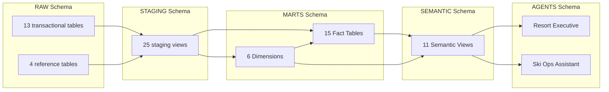

# Ski Resort Analytics dbt Project

Kimball-style dimensional model for year-round ski resort operations analytics. Powers 11 semantic views consumed by 2 Cortex Agents (Resort Executive Assistant + Ski Operations Assistant).

## Entity Relationship Diagram

```mermaid
erDiagram
    DIM_DATE ||--o{ FACT_TICKET_SALES : "purchase_date_key"
    DIM_DATE ||--o{ FACT_LIFT_SCANS : "date_key"
    DIM_DATE ||--o{ FACT_PASS_USAGE : "date_key"
    DIM_DATE ||--o{ FACT_RENTALS : "rental_date_key"
    DIM_DATE ||--o{ FACT_FOOD_BEVERAGE : "transaction_date_key"
    DIM_DATE ||--o{ FACT_WEATHER : "date_key"
    DIM_DATE ||--o{ FACT_STAFFING : "schedule_date_key"
    DIM_DATE ||--o{ FACT_INCIDENTS : "date_key"
    DIM_DATE ||--o{ FACT_LESSONS : "lesson_date_key"
    DIM_DATE ||--o{ FACT_FEEDBACK : "feedback_date_key"
    DIM_DATE ||--o{ FACT_GROOMING : "date_key"
    DIM_DATE ||--o{ FACT_LIFT_MAINTENANCE : "date_key"
    DIM_DATE ||--o{ FACT_PARKING : "date_key"

    DIM_CUSTOMER ||--o{ FACT_TICKET_SALES : "customer_key"
    DIM_CUSTOMER ||--o{ FACT_LIFT_SCANS : "customer_key"
    DIM_CUSTOMER ||--o{ FACT_PASS_USAGE : "customer_key"
    DIM_CUSTOMER ||--o{ FACT_RENTALS : "customer_key"
    DIM_CUSTOMER ||--o{ FACT_FOOD_BEVERAGE : "customer_key"

    DIM_TICKET_TYPE ||--o{ FACT_TICKET_SALES : "ticket_type_key"
    DIM_PRODUCT ||--o{ FACT_RENTALS : "product_key"
    DIM_PRODUCT ||--o{ FACT_FOOD_BEVERAGE : "product_key"
    DIM_LOCATION ||--o{ FACT_TICKET_SALES : "location_key"
    DIM_LOCATION ||--o{ FACT_RENTALS : "location_key"
    DIM_LOCATION ||--o{ FACT_FOOD_BEVERAGE : "location_key"
    DIM_LIFT ||--o{ FACT_LIFT_SCANS : "lift_key"
    DIM_LIFT ||--o{ FACT_LIFT_MAINTENANCE : "lift_key"

    DIM_DATE {
        int DATE_KEY PK "YYYYMMDD integer"
        date FULL_DATE "Calendar date"
        varchar SKI_SEASON "e.g. 2024-2025"
        varchar SEASON_TYPE "winter or summer"
        boolean IS_SUMMER_SEASON
        boolean IS_WEEKEND
        boolean IS_HOLIDAY
        varchar SNOW_CONDITION
        boolean IS_OPERATING
    }

    DIM_CUSTOMER {
        varchar CUSTOMER_KEY PK "Surrogate (SCD2)"
        varchar CUSTOMER_ID "Natural key"
        varchar CUSTOMER_SEGMENT
        varchar AGE_GROUP
        varchar HOME_STATE
        boolean IS_PASS_HOLDER
        boolean IS_CURRENT
    }

    DIM_TICKET_TYPE {
        varchar TICKET_TYPE_KEY PK "Surrogate (SCD2)"
        varchar TICKET_TYPE_ID "Natural key"
        varchar TICKET_NAME
        varchar TICKET_CATEGORY "day_pass|half_day|multi_day|season_pass|summer_activity"
        int PRICE
        boolean IS_CURRENT
    }

    DIM_PRODUCT {
        varchar PRODUCT_KEY PK "Surrogate (SCD2)"
        varchar PRODUCT_ID "Natural key"
        varchar PRODUCT_NAME
        varchar PRODUCT_CATEGORY "rental|food|beverage"
        varchar PRODUCT_TYPE "ski|snowboard|bike|safety|meal|hot|cold|alcohol"
        int PRICE
    }

    DIM_LOCATION {
        varchar LOCATION_KEY PK "Surrogate"
        varchar LOCATION_ID
        varchar LOCATION_NAME
        varchar LOCATION_TYPE
        varchar MOUNTAIN_ZONE
    }

    DIM_LIFT {
        varchar LIFT_KEY PK "Surrogate"
        varchar LIFT_ID
        varchar LIFT_NAME
        varchar LIFT_TYPE "Gondola|Chairlift"
        varchar TERRAIN_TYPE
        int CAPACITY_PER_HOUR
    }

    FACT_TICKET_SALES {
        varchar SALE_KEY PK
        int PURCHASE_DATE_KEY FK
        varchar CUSTOMER_KEY FK
        varchar TICKET_TYPE_KEY FK
        varchar LOCATION_KEY FK
        int PURCHASE_AMOUNT
        varchar TICKET_CATEGORY
    }

    FACT_LIFT_SCANS {
        varchar SCAN_KEY PK
        int DATE_KEY FK
        varchar CUSTOMER_KEY FK
        varchar LIFT_KEY FK
        float WAIT_TIME_MINUTES
    }

    FACT_LESSONS {
        varchar LESSON_ID PK
        int LESSON_DATE_KEY FK
        varchar SPORT_TYPE "ski|snowboard|mountain_bike|hiking|adventure"
        varchar LESSON_TYPE
        varchar SKILL_LEVEL
        float TOTAL_LESSON_REVENUE
        float STUDENT_RATING
    }

    FACT_INCIDENTS {
        varchar INCIDENT_ID PK
        int DATE_KEY FK
        varchar INCIDENT_TYPE
        varchar SEVERITY
        float PATROL_RESPONSE_MINUTES
    }

    FACT_FEEDBACK {
        varchar FEEDBACK_ID PK
        int FEEDBACK_DATE_KEY FK
        varchar CATEGORY
        varchar SENTIMENT
        float NPS_SCORE
        float RATING
    }
```



## Data Flow



## Year-Round Operations

The resort operates year-round with two seasons:

| Season | Months | Activities | Ticket Types |
|--------|--------|-----------|--------------|
| **Winter** | Nov - Apr | Skiing, snowboarding, night skiing | TKT001-TKT018 (day_pass, half_day, multi_day, season_pass) |
| **Summer** | May - Oct | Bike park, hiking, scenic gondola, concerts, zip lines | TKT_BIKE, TKT_HIKE, TKT_GONDOLA, TKT_CONCERT, TKT_COMBO |

Filter by `DIM_DATE.SEASON_TYPE` = `'winter'` or `'summer'` across all fact tables.

### Summer-Specific Data

| Domain | Summer Values |
|--------|--------------|
| Lift scans | 5 lifts operate (L001, L002, L004, L009, L010) for bike uplift + scenic gondola |
| Lessons | mountain_bike_beginner/intermediate/advanced, guided_hike, kids_adventure_camp |
| Incidents | bike_crash, trail_fall, dehydration, wildlife_encounter, equipment_failure |
| Rentals | Mountain bike ($65), E-bike ($95), Hiking poles ($15), Climbing gear ($45) |
| Feedback | bike_park, trail_conditions, events categories |
| Staffing | Smaller crews: Lift Ops, Rentals, F&B, Ticket Sales, Trail Patrol, Grounds |

## Dimensions

| Dimension | Rows | SCD Type | Key |
|-----------|------|----------|-----|
| `dim_date` | 2,784 | Generated (10yr spine) | `DATE_KEY` (YYYYMMDD int) |
| `dim_customer` | 8,000 | Type 2 | `CUSTOMER_KEY` (surrogate) |
| `dim_ticket_type` | 23 | Type 2 | `TICKET_TYPE_KEY` (surrogate) |
| `dim_product` | 37 | Type 2 | `PRODUCT_KEY` (surrogate) |
| `dim_location` | 21 | Type 1 | `LOCATION_KEY` (surrogate) |
| `dim_lift` | 18 | Type 1 | `LIFT_KEY` (surrogate) |

## Fact Tables

| Fact | Grain | Incremental On | cluster_by | Key Dims Joined |
|------|-------|---------------|------------|-----------------|
| `fact_ticket_sales` | 1 row per sale | `purchase_timestamp` | `purchase_date_key` | date, customer, ticket_type, location |
| `fact_lift_scans` | 1 row per scan | `scan_timestamp` | `date_key` | date, customer, lift |
| `fact_pass_usage` | 1 row per visit | `visit_date` | `date_key` | date, customer |
| `fact_rentals` | 1 row per rental | `rental_timestamp` | `rental_date_key` | date, customer, product, location |
| `fact_food_beverage` | 1 row per txn | `transaction_timestamp` | `transaction_date_key` | date, customer, product, location |
| `fact_weather` | 1 row per zone/day | `created_at` | - | date |
| `fact_staffing` | 1 row per dept/day | `created_at` | - | date, location |
| `fact_incidents` | 1 row per incident | `created_at` | - | date |
| `fact_lessons` | 1 row per lesson | `created_at` | `lesson_date_key` | date |
| `fact_feedback` | 1 row per feedback | `created_at` | `feedback_date_key` | date |
| `fact_grooming` | 1 row per run | `created_at` | - | date |
| `fact_lift_maintenance` | 1 row per event | `created_at` | - | date, lift |
| `fact_parking` | 1 row per lot/hour | `created_at` | - | - |
| `fact_season_pass_sales` | 1 row per sale | `created_at` | - | - |
| `fact_marketing` | 1 row per campaign | `created_at` | - | date |

## Semantic Views

Each semantic view is materialized via the `Snowflake-Labs/dbt_semantic_view` package and includes:
- `WITH EXTENSION (CA = $$...$$)` block with `module_custom_instructions` and `verified_queries`
- DIM_DATE relationship for SEASON_TYPE, SKI_SEASON filtering (all 11 views)

| Semantic View | Domain | Tables | Key Metrics |
|--------------|--------|--------|-------------|
| `sem_daily_summary` | Executive KPIs | date, lift_scans, pass_usage, ticket_sales, rentals, f&b | TOTAL_VISITS, TOTAL_DAILY_REVENUE, AVG_WAIT_TIME |
| `sem_revenue` | Revenue analytics | date, ticket_sales, rentals, f&b, ticket_type, product, location | TICKET_REVENUE, RENTAL_REVENUE, FNB_REVENUE |
| `sem_operations` | Lift + trails | date, lift_scans, maintenance, grooming, lift | TOTAL_SCANS, AVG_WAIT_MINUTES, CONDITION_IMPROVEMENT |
| `sem_lessons_analytics` | Instruction | date, lessons | TOTAL_LESSONS, TOTAL_REVENUE, AVG_STUDENT_RATING |
| `sem_safety_incidents` | Safety | date, incidents | TOTAL_INCIDENTS, AVG_PATROL_RESPONSE, CRITICAL_INCIDENTS |
| `sem_customer_satisfaction` | Feedback | date, feedback | AVERAGE_RATING, AVERAGE_NPS, TOTAL_FEEDBACK |
| `sem_staffing_analytics` | Labor | date, staffing, location | AVG_COVERAGE, UNDERSTAFFED_COUNT |
| `sem_weather_analytics` | Weather | date, weather | TOTAL_SNOWFALL, POWDER_DAY_COUNT |
| `sem_passholder_analytics` | Pass holders | date, pass_usage, season_pass_sales, customer | PASS_HOLDER_VISITS, AVG_VISITS_PER_PASS_HOLDER |
| `sem_marketing_analytics` | Campaigns | date, marketing | TOTAL_CONVERSIONS, AVG_CONVERSION_RATE |
| `sem_customer_behavior` | Segmentation | date, pass_usage, customer | TOTAL_VISITS, UNIQUE_CUSTOMERS |

## Setup

```bash
cd dbt_ski_resort
dbt deps
dbt debug
dbt seed --full-refresh   # Load reference data (ticket types, products, etc.)
dbt run --full-refresh    # Full build (first time or after schema changes)
dbt test                  # Validate relationships and constraints
```

## Incremental Loads

After initial setup, daily refreshes only process new data:

```bash
dbt run                   # Incremental (appends new rows since last MAX timestamp)
```

Use `--full-refresh` when:
- Adding new columns to fact tables (e.g., `date_key`)
- Changing the incremental strategy or unique_key
- Backfilling historical data that has timestamps older than existing MAX

## Environment Configuration

| Target | Database | Warehouse | Role |
|--------|----------|-----------|------|
| `dev` | `AM_SKI_RESORT_DEV` | `AM_SKI_RESORT_WH_DEV` | `AM_DEPLOY_ROLE_DEV` |
| `qa` | `AM_SKI_RESORT_QA` | `AM_SKI_RESORT_WH_QA` | `AM_DEPLOY_ROLE_QA` |
| `prod` | `AM_SKI_RESORT` | `AM_SKI_RESORT_WH` | `AM_DEPLOY_ROLE` |

## Customer Personas (7 segments)

| Segment | Share | Characteristics |
|---------|-------|-----------------|
| Local Season Pass Holders | 15% | High frequency, low per-visit spend |
| Weekend Warriors | 25% | Regular weekends, moderate spend |
| Vacation Families | 30% | Multi-day stays, high total spend |
| Day Trippers | 20% | Single visits, price-sensitive |
| Expert/Backcountry | 5% | Terrain-focused, equipment rentals |
| Groups & Corporate | 3% | Large parties, event bookings |
| Beginners/First-Timers | 2% | Lesson-heavy, rental-heavy |

## Resort Infrastructure

- **18 lifts** (2 gondolas + 16 chairlifts) across 4 mountain zones
- **5 lifts** operate in summer (bike uplift + scenic gondola)
- **2,000-5,000 daily visitors** (seasonal variation)
- **5+ years of data** (November 2020 to present, year-round)
