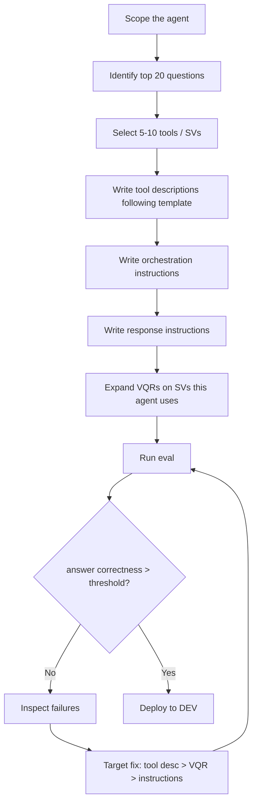

# Agent Development Framework

This directory contains the best-practices playbook for building, improving,
and evaluating Cortex Agents in this repository. Every new agent or major
change follows the documented workflow so quality is consistent, measurable,
and reviewable.

## Contents

| Doc | Purpose |
|---|---|
| [AGENT_BEST_PRACTICES.md](AGENT_BEST_PRACTICES.md) | Condensed principles: scoping, tool descriptions, orchestration, response instructions, testing |
| [TOOL_DESCRIPTION_TEMPLATE.md](TOOL_DESCRIPTION_TEMPLATE.md) | The exact template every tool description must follow |
| [VQR_AUTHORING_GUIDE.md](VQR_AUTHORING_GUIDE.md) | How to pick VQR candidates from eval failures and write them |
| [AGENT_OPTIMIZATION_CHECKLIST.md](AGENT_OPTIMIZATION_CHECKLIST.md) | Step-by-step checklist when creating a new agent or optimizing an existing one |
| [templates/new_agent_spec.yml](templates/new_agent_spec.yml) | Copy-and-fill starter for `agents/specs/*.yml` |
| [MEASUREMENT_RESULTS.md](MEASUREMENT_RESULTS.md) | Running record of eval deltas per framework version |

## Core principle

> **Data engineering and semantic-model design beat prompt engineering.**

An ounce of work on tool descriptions, SV structure, and Verified Queries
(VQRs) is worth a pound of instruction tweaks. The framework optimizes in
that order.

## The order of operations

## When to update this framework

Update the artifacts in this directory when:

- A new failure pattern emerges that the template does not yet address
- Snowflake ships a Cortex Agent / Analyst feature that changes best practices
- An eval reveals a recurring issue not called out in the checklist

Every update to this framework should be tied to a measurable improvement
in the eval deltas (see [MEASUREMENT_RESULTS.md](MEASUREMENT_RESULTS.md)).
